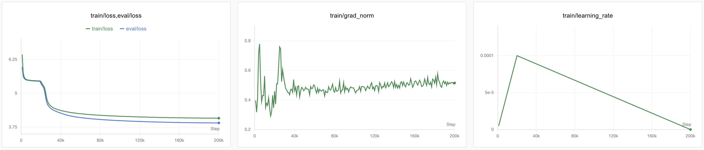
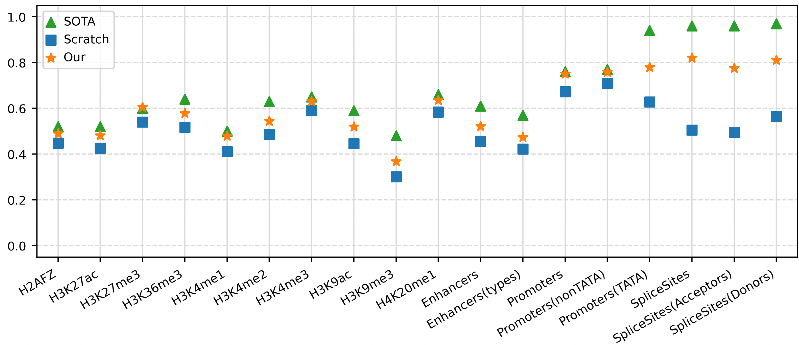

  
# TinyDNABERT

TinyDNABERT is a lightweight genomic language model built from scratch, employing a BPE tokenizer and a RoBERTa architecture. It is pre-trained on the human reference genome [GRCh38.p14](https://www.ncbi.nlm.nih.gov/datasets/genome/GCF_000001405.40/) and evaluated using the [NT Benchmark](https://huggingface.co/datasets/InstaDeepAI/nucleotide_transformer_downstream_tasks_revised). Training is performed using only two NVIDIA RTX 4090 GPUs. All [processed datasets](https://huggingface.co/datasets/ChengsenWang/TinyDNABERT-PretrainData-V1) and [pre-trained models](https://huggingface.co/ChengsenWang/TinyDNABERT-20M-V1) are publicly available on Hugging Face.

Most existing genomic language models only open-source the inference components, with complete training pipelines from scratch rarely provided. This lack of transparency makes it difficult for beginners to learn and experiment. I hope TinyDNABERT can serve as a valuable resource for newcomers interested in genomic language modeling.

## 📈 Pre-training

During the preprocessing stage, we remove all “N” markers from the FASTA file and randomly split the remaining sequences into segments ranging from 256 to 1024 base pairs, resulting in a total of 4,904,969 training samples. To accommodate memory constraints, we uniformly sample one-tenth of these sequences to train the BPE tokenizer. The vocabulary size is set to 1,024, and the minimum frequency threshold is set to 4.

TinyDNABERT is designed with a hidden size of 512, 6 transformer layers, 8 attention heads, and an intermediate size of 2048. In total, the model contains 19,968,512 parameters.

We pretrain TinyDNABERT using the MLM objective with a masking rate of 15%. The model is trained with a batch size of 128 and a maximum sequence length of 512. We use the AdamW optimizer for 200,000 steps ($\approx$ 40 epochs) with a weight decay of 1e-5, $\beta_1$=0.9, $\beta_2$=0.999 and $\epsilon$=1e−8. The learning rate is linearly warmed up from 0 to 1e-4 over the first 20,000 steps and then linearly decay back to 0 over the remaining 180,000 steps. Pretraining is conducted on two NVIDIA RTX 4090 GPUs and takes approximately 64 hours, costing around 300 RMB (2.29/hour/card $\times$ 2 cards $\times$ 64 hours) in [AutoDL](https://www.autodl.com/).

## 📝 Evaluate

The evaluation phase follow a procedure similar to pretraining. We retain a batch size of 64 and use the AdamW optimizer for 5,000 steps with a weight decay of 1e-5, $\beta_1$=0.9, $\beta_2$=0.999 and $\epsilon$=1e−8. The learning rate is linearly increased from 0 to 1e-4 during the first 500 steps and then linearly decay to 0 over the remaining 4,500 steps.We compare the performance (MCC) of TinyDNABERT against two baselines:

- Scratch: The same model architecture fine-tuned from scratch without any pretraining
- SOTA: The state-of-the-art results reported in the [Nucleotide Transformer Paper](https://www.nature.com/articles/s41592-024-02523-z)

Compared to training from scratch, TinyDNABERT achieves a 19.77% performance improvement, reaching 89.38% of the SOTA level.

Judging from the pretraining loss, TinyDNABERT has not yet reached its full performance potential. With longer training time and more data, it can likely achieve even more impressive results. However, as the objective of this project tutorial is already fulfilled, and given our limited resources, we make the difficult decision to terminate its pretraining.

## 🙏 Acknowledgment

This project is developed with reference to the following works:

- [Transformers Github](https://github.com/huggingface/transformers/blob/main/examples/pytorch/language-modeling/run_mlm.py)
- [Fine-tune a Language Model](https://colab.research.google.com/github/huggingface/notebooks/blob/master/examples/language_modeling.ipynb)
- [Build a RoBERTa Model from Scratch](https://yulianudelman.medium.com/build-a-roberta-model-from-scratch-c5c8c192b5f9)
- [Create a Tokenizer and Train a Huggingface RoBERTa Model from Scratch](https://medium.com/analytics-vidhya/create-a-tokenizer-and-train-a-huggingface-roberta-model-from-scratch-f3ed1138180c)

## 📪 Contact

If you have any question, please contact [cswang@bupt.edu.cn](cswang@bupt.edu.cn)

